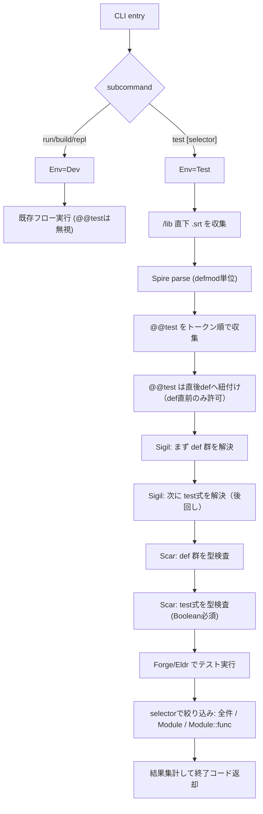

# Surtr Test Runner Design (Phase 1)

最終更新: 2026-04-05

2026-04-08 メモ:

- `@@builtin` と `@@test` が同一標準 module に共存するケースを future coverage に追加する
- `@@builtin` 単独行 form を前提にしているため、annotation の並び順は pending 回帰テストで固定する

## 1. 目的

標準モジュール作成前に、Surtrコードのみで自己検証できる `surtr test` 実行基盤を導入する。

- `surtr test` : 全件実行
- `surtr test Kernel` : モジュール単位
- `surtr test Kernel::add` : 関数単位

## 2. 確定仕様

### 2.1 実行環境

- Env は現時点で `Dev` / `Test` の2値のみ。
- CLI入口で Env を決定する。
- 現時点ではハードコード運用を許容する。

### 2.2 `@@test` の基本ルール

- `@@test` は複数記述可能。
- 収集順はトークン出現順。
- `@@test` は `def` の直前にのみ記述可能。
- `@@test` は `surtr test` 実行時のみコンパイル対象に含める。
- `run/build/repl` では `@@test` を取り込まない。

### 2.3 探索対象

- `surtr test` の探索対象は `/lib` 直下の `.srt` のみ。

### 2.4 対象式

- 現時点では比較演算子を含む式のみサポート。
- 対応演算子: `==`, `!=`, `<`, `<=`, `>`, `>=`

### 2.5 失敗表示

失敗時は次を表示する。

- 式文字列 (`expr`)
- 左辺式と評価結果 (`lhs`)
- 右辺式と評価結果 (`rhs`)
- 演算子 (`op`)
- 場所 (`file:line:column`)

Bool比較の可読性のため、演算子表示は正規化する。

- `==` -> `eq`
- `!=` -> `neq`

例:

```text
[FAIL] Kernel::add (lib/kernel.srt:12:3)
  expr: add(10, 4) != 6
  lhs : add(10, 4) => 14
  rhs : 6 => 6
  op  : neq
```

## 3. 実行フロー



## 4. Issue分割（1 Issue = 1 Commit）

| Issue | コミット名（例） | 実装内容 | 完了条件 |
|---|---|---|---|
| TST-001 | `spec: add @@test + Env(Dev/Test) rules` | `!=` を正式化、`@@test` は `def` 直前のみ、`Env=Dev/Test` をCLI入口で決定、`test` 時のみ有効を仕様化 | 仕様文書に矛盾がない |
| TST-002 | `rune: add test subcommand and Env switch` | `surtr test` / `surtr test <selector>` を追加し、入口で `Env=Dev/Test` を確定 | CLI usage と引数パースが通る |
| TST-003 | `spire: introduce generic annotation container` | annotation を複数保持可能にし、同名をリスト集約できるAST/中間構造を導入 | 既存 `@@builtin` を壊さず unit test 通過 |
| TST-004 | `spire: parse @@test and bind to next def` | `@@test <expr>` 構文追加、トークン順収集、`def` 直前以外は `ParseError` | `@@test` の正/誤ケースを parser test で検証 |
| TST-005 | `xldr/spire: env-based annotation inclusion policy` | `Env=Dev` では `@@test` を落とし、`Env=Test` で保持する分岐を追加 | `run/build` で `@@test` 非実行、`test` で有効 |
| TST-006 | `sigil: deferred resolution for test expressions` | def 解決後に test式を解決する2段処理を導入（後回し要件） | 前方参照を含む test式が解決可能 |
| TST-007 | `scar: typecheck @@test expressions as Boolean` | test式の型検査を追加し、`Boolean` 以外を compile error 化 | `compile_errors` に型不一致ケース追加 |
| TST-008 | `rune: execute tests with selector filtering` | 全件/Module/Module::func のフィルタ実行、トークン順実行、pass/fail集計 | 3形態の `surtr test` が動作 |
| TST-009 | `rune: lib root discovery and reporting` | 探索範囲を `/lib` 直下 `.srt` のみに固定し、結果表示と終了コードを確定 | 成功=0、失敗あり=非0、出力が安定 |
| TST-010 | `integration: add end-to-end fixtures for test command` | `@@test` 正常系・失敗系・selector系の統合テスト追加 | `cargo test -p rune` で通過 |
| TST-011 | `integration: cover std-module @@builtin + @@test coexistence` | `@@builtin` 単独行、`@@test` 併記、標準 module 読み込み順の回帰テストを追加 | ignored 先置き後、仕様確定時に unignore できる |
